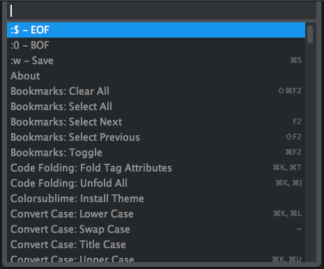

sublime-text-tips
=================

SublimeText 是近年迅速竄紅的文字編輯器之一，受到很多前端以及程式設計師的喜愛。但歷經了 SublimeText 2 以及 SublimeText 3 兩種版本的演進之後，網路上眾多對於如何設定與使用 SublimeText 的相關文件已有些雜亂無章。為此，本文件希望透過整理，將雜亂的資訊整合，以降低進入門檻，便利他人迅速學習使用 SublimeText 。

# Useful Shortcuts (Mac OS X)

事實上，學會利用 SublimeText 快捷鍵是提升編輯效率的一大良方。本章節在此條列較常被使用的幾種快捷鍵，可使人迅速體驗 SublimeText 的魅力。

## Command Palette

`Command Palette` 是 SublimeText 的重要功能之一，許多的功能都可以透過 `Command Palette` 進行呼叫，例如自動美化排版、設定 Language Syntax 等，因此在使用 SublimeText 過程中，是絕對少不了呼叫 `Command Palette` 的。

快捷鍵:

```
Command + Shift + P
```

圖示:



## Python Console

SublimeText 其實內建有 Python Console，對於有在撰寫 Python 的開發者其實可以嘗試看看。此外，著名的 SublimeText `Package Control` 套件就是透過 Python Console 進行安裝的。

快捷鍵:

```
Ctrl + `
```

圖示:


## 多重選取

多重選取是 SublimeText 其中一個相當實用的功能，對於需要經常修正程式變數名稱的人而言，是一個相當俱有吸引力的功能。

多重選取 & 編輯示意圖:


快捷鍵 1

1. 選取文字之後
2. **重複** 按 `Commando + D` 可以一次將所有相同文字選取起來
3. 依照需求進行編輯

快捷鍵 2

1. 選取文字之後
2. 按 `Ctrl + Commando + G` 可以一次將相同文字選起來
3. 依照需求進行編輯

## 行操作

### 合併多行成一行

示意圖:

快捷鍵:

1. 選取要合併的文字
2. 按 `Command + J`

### 上下行互換

示意圖:


快捷鍵:

```
Command + Ctrl + 上/下方向鍵
```

### 單行註解

快捷鍵:

```
Command + /
```

### 多行註解

快捷鍵 1:

1. 選取要註解的文字
2. 按 `Command + Shift + /`

快捷鍵 2:

1. 選取要註解的文字
2. 按 `Command + Shift + P` 呼叫 `Command Palette`
3. 輸入 `toggle comment` 或 `toggle block comment`

    > Toggle comment -> 單行註解
    >
    > Toggle block comment -> 多行註解

## 文字編輯

### 大小寫轉換

快捷鍵 1:

1. 選取文字
2. 按 `Command + K` 放開後，迅速按 `u` 或 `U`

快捷鍵 2:

1. 選取文字
2. 按 `Command + Shift + P` 呼叫 `Command Palette`
3. 可輸入 `title`, `lower case`, `upper case`

    >Title -> 首字大寫
    >
    >Lower Case -> 全部小寫
    >
    >Upper Case -> 全部大寫


## 搜尋/取代

### 全專案搜尋 ＆ 取代 

快捷鍵:

```
Command + Shitf + F
```

## 游標操作

### 跳至特定行

快捷鍵 1:

1. 按 `Command + P`
2. 輸入 `:行號`

快捷鍵 2:

1. 按 `Ctrl + G` 
2. 輸入行號

### 跳到對應的 大/中/小括號

```
Ctrl + M
``` 

## 捲軸操作

### 移動捲軸

快捷鍵:

```
Ctrl + Alt + 上/下 方向鍵
```

## 分頁操作

### 分頁間切換

```
Command + Alt + 左/右 方向鍵
```

## 切割視窗

SublimeText 也有相當簡便的視窗切割功能，對於多視窗編輯相當有幫助。

### 水平切割視窗

快捷鍵:

```
Command + Alt + Shift + 2/3
```

> 2 代表切 2 格
> 3 代表切 3 格

### 垂直切割視窗

```
Command + Alt + 1/2/3/4
```

### 回復單個視窗

快捷鍵:

```
Command + Alt + 1
```

## 其他

### 結束當前的 HTML 標籤

例如輸入完 `<div>Hello, SublimeText` 之後，自動補完 `</div>`。對 Web 前端開發者相當方便的功能。

快捷鍵:

```
Command + Alt + .
```

更多關於 [SublimeText 快捷鍵](http://sublime-text-unofficial-documentation.readthedocs.org/en/latest/reference/keyboard_shortcuts_osx.html)


# SublimeText 基本設定 (Mac OS X)

Preferences > Settings — User 可以打開設定檔 (快捷鍵: `command + ,`)

貼上以下設定 (註：Sublime Text所有設定檔都是 JSON 格式)

```
{
	"always_show_minimap_viewport": true, // 顯示右邊的縮圖
	"draw_minimap_border": true, // 右邊的縮圖要畫邊線
	"caret_style": "solid",  // 將游標變 no blinking
	"wide_caret": true, // 將游標變寬
	"file_exclude_patterns": // 要忽略的檔名格式
    [
        ".DS_Store",
        "*.pid",
        "*.pyc"
    ],
	"folder_exclude_patterns": // 會被Sublime Text忽略的資料夾名，不會顯示在 Sidebar
	[
		".svn",
		".git",
		".hg",
		"CVS",
		"__pycache__"
	],
	"font_size": 18,
	"ignored_packages":
	[
	    "vintage" // 如果想打開 vi 模式，就刪除此行
	],
	"rulers": // 尺標，寫程式經常要注意是否寫太長，就可以用尺標提醒自己
 	[
		72,
		79
	],
	"tab_size": 4, // Tab 的寬度，4 個 Space 的寬度
	"translate_tabs_to_spaces": true, // 強制將 Tab 用 Space 來取代
	"trim_trailing_white_space_on_save": true,  // 存檔時，自動將行尾的空白去掉
	"ensure_newline_at_eof_on_save": true,
}
```
## 不同語言不同設定檔

For language specific settings click Sublime Text > Preferences > Settings – More > Syntax Specific – User. Then save the file using the following format: LANGUAGE.sublime-settings. So, for Python-specific settings, save the file as `Python.sublime-settings`.

```
{
    // editor options
    "draw_white_space": "all",

    // tabs and whitespace
    "auto_indent": true,
    "rulers": [79],
    "smart_indent": true,
    "tab_size": 4,
    "trim_automatic_white_space": true,
    "use_tab_stops": true,
    "word_wrap": true,
    "wrap_width": 80
}
```

更多設定資訊 http://sublime-text-unofficial-documentation.readthedocs.org/en/latest/reference/settings.html

## 更換字體

推薦程式用的字體下載 http://www.slant.co/topics/67/~what-are-the-best-programming-fonts

```
    // Font設定範例
    "font_face": "Ubuntu Mono",
    "font_size": 16.0,
    "font_options": ["subpixel_antialias", "no_bold"],
    "line_padding_bottom": 0,
    "line_padding_top": 0,
```

## 必裝 Packages

- Package Control https://sublime.wbond.net/installation#st3

## 推薦的Packages

### 佈景主題類

- Flatland

```
{
  "theme": "Flatland Dark.sublime-theme",
  "color_scheme": "Packages/Theme - Flatland/Flatland Dark.tmTheme"
}
```

- Color Scheme - Tomorrow Night 黑暗系的 Color Theme

- Theme - Soda Dark Themes 

color theme 影響的是文字的配色

theme 影響的是sublime text視窗的配色

### vim 愛用者

- Vintageous

### 功能強化類

- SideBarEnhancements 強化SideBar功能 
- SublimeCodeIntel 自動補完功能
- GitGutter 會在編輯器的行數顯示旁邊，依照 Git 編輯的狀態，顯示不同的圖標，例如新增刪除修改
- sublimelinter 提供一個linter的框架，讓你可以安裝不同的 linter  https://github.com/SublimeLinter/SublimeLinter3 
- HTML-CSS-JS Prettify 自動排版 (輸入指令HTMLPrettify 就可以自動排版)


## 如何換佈景主題(Theme)

- colorsublime
    
        http://colorsublime.com/how-to-install-a-theme

- 其他佈景主題

        https://github.com/mediachicken/sublimetext-defaultplus-theme


## 將 Sublime Text 設定為 終端機指令 之一

```
ln -s /Applications/Sublime\ Text\ 2.app/Contents/SharedSupport/bin/subl /usr/local/bin/subl
```

就可以用 `subl` 打開檔案

```
subl helloworld.py
```

## 將 sublime 作為 預設編輯器

要先將Sublime Text 設定為 終端機指令 之一


```
alias nano="subl"
export EDITOR="subl"
```


## 將 Sublime 作为 Git 預設編輯器使用

要先將Sublime Text 設定為 終端機指令 之一

```
export GIT_EDITOR="subl --wait --new-window"
```


## Python 開發者值得一看的設定文章

https://realpython.com/blog/python/setting-up-sublime-text-3-for-full-stack-python-development/


## 前端開發者值得一看的設定文章

http://blog.miniasp.com/post/2014/01/07/Useful-tool-Sublime-Text-3-Quick-Start.aspx


## reference

https://realpython.com/blog/python/setting-up-sublime-text-3-for-full-stack-python-development/

